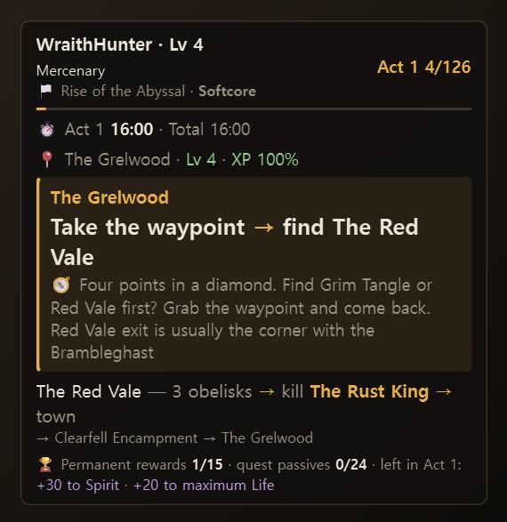
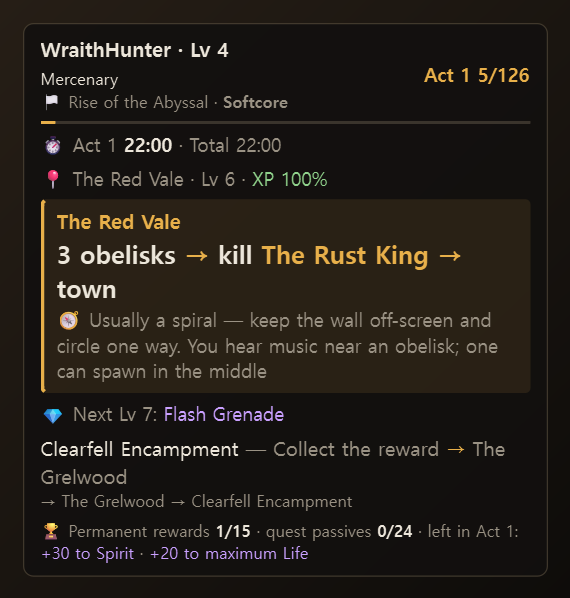
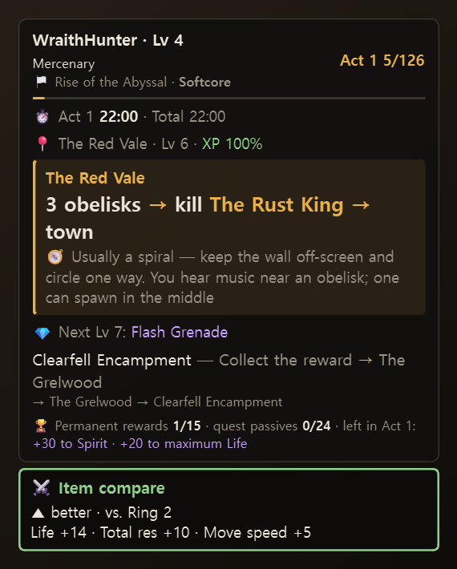
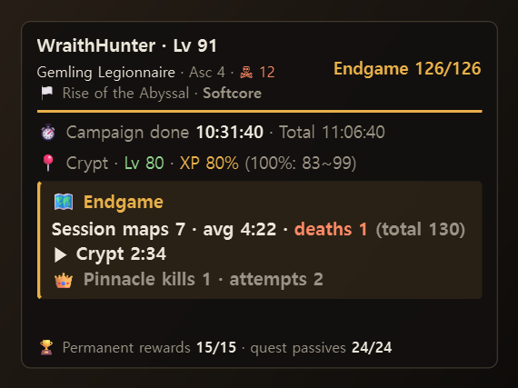

# POE2 Campaign Guide Overlay

[한국어](README.md) · **English**

An overlay that shows **what to do next** in the Path of Exile 2 campaign, in a corner of your game screen.
It only reads the log file the game writes, so it follows the character you log in with and the areas you enter.
You don't press anything to advance the guide.

## What it does

| | |
|---|---|
| **Auto-advancing guide** | The guide step follows you as you change areas. Quick town visits are ignored, and it won't move past a step until its boss is dead. |
| **Boss fight tracking** | Boss lines mark the fight start, phases and the kill; during a fight the panel shrinks to one line. |
| **Permanent rewards & quest passives** | Which campaign rewards (resistances, spirit, life…) and how many of the 24 quest passive points you have, and what is still left in this act. |
| **Zone layout tips 🧭** | Short "follow the wall clockwise" style hints for each area. |
| **XP efficiency** | Experience penalty from your level vs. the area level. |
| **Act split timer** | Time per act and the difference to your best previous character (PB). |
| **Item compare** | Ctrl+C a piece of gear in game and see if it beats what you are wearing. |
| **Gem guide** | Reads the build linked in the in-game Build Planner and shows the skills and supports for your level, and what unlocks next. |
| **Endgame log** | For characters that finished the campaign: maps this session, average time, deaths, pinnacle boss attempts and kills. |
| **English / 한국어** | Works with the Steam/GGG (English) and Kakao (Korean) clients. The screen language can be chosen separately. |

<table>
<tr>
<td> Campaign</td>
<td> Item compare (Ctrl+C)</td>
<td> Endgame log</td>
</tr>
</table>

## Getting started

1. Download one of these from [Releases](../../releases):
   - `poe2-overlay.exe` — a single file, just run it (starts 1–2 s slower)
   - `poe2-overlay-*.zip` — a folder; unzip anywhere (starts faster, and the guide/data files in `guides` can be edited)
2. Set the game to **Windowed Fullscreen** (borderless). The overlay cannot draw over exclusive fullscreen.
3. Run `poe2-overlay.exe`. The game log is found automatically.
   If Windows SmartScreen says "unknown publisher", click **More info → Run anyway** (it is an unsigned personal tool).
4. Log in and change area — the character and guide position are picked up on their own.

On the first run it reads your whole log, so earlier characters' progress and splits come back too (a few seconds).

## Basic controls

| Key | Action |
|---|---|
| `Ctrl+Alt+→` / `←` | Next / previous step (if auto-advance got it wrong) |
| `Ctrl+Alt+R` | Rewards, splits and pinnacle boss list |
| `Ctrl+Alt+G` | Gem card |
| `Ctrl+Alt+T` | Click-through (the mouse passes through the panel) |
| `Ctrl+Alt+H` | Hide / show |
| `Ctrl+C` on gear in game | Item compare (press twice to save it as "what I'm wearing") |

Hover the panel to get `◀ ▶ 🏆 💎 ⚙` icons in the top-right corner. Right-click opens the full menu.
See the **[user manual](docs/MANUAL.en.md)** for everything else.

## Is it safe?

- **It only reads the game's log file.** It does not read game memory, send key presses to the game, or modify game files.
- It reads the clipboard only for item text you copy **while the game window is in front**.
- It never goes online. Everything is stored on your PC (`%APPDATA%\poe2-overlay`).

A personal tool, not affiliated with Grinding Gear Games or Kakao Games.

### English client status

The English client is newer than the Korean one. Area tracking, level-ups, deaths, rewards, quest passives and
the endgame log work. Boss **kill and phase lines** are only known for the Korean client so far — on English,
a boss fight starts on the boss's first line and counts as killed when you leave the area alive.
If you notice a reward that never ticks or a boss that never shows, please open an issue with the log lines.

## License

[MIT](LICENSE)

## Credits

- Some zone tips: summarised from [POE2Radar](https://github.com/Sikaka/POE2Radar) `zone_notes.json` (MIT, originally Path of Levelling 2)
- English boss, area and reward names: [poe2db.tw](https://poe2db.tw)
- English client log format: documented in [bear421/poe-map-log-viewer](https://github.com/bear421/poe-map-log-viewer) (MIT)
- Gem internal ID → name: [Path of Building (PoE2)](https://github.com/PathOfBuildingCommunity/PathOfBuilding-PoE2) `Data/Gems.lua`
- If Reim's PoE Act Guide CSV is on your PC, it is used as the Korean guide (not bundled).
