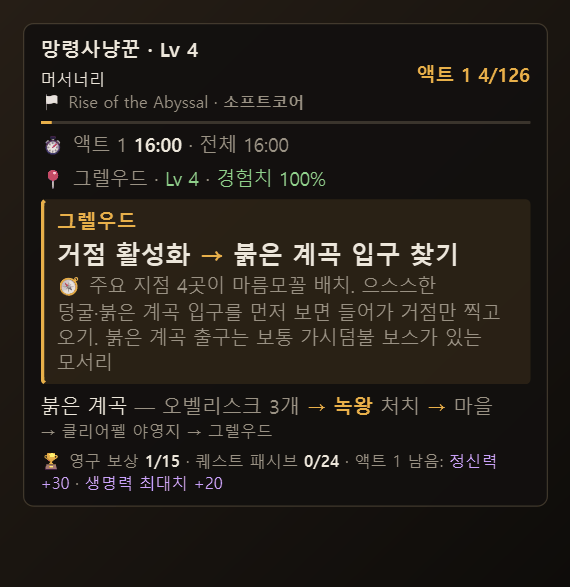
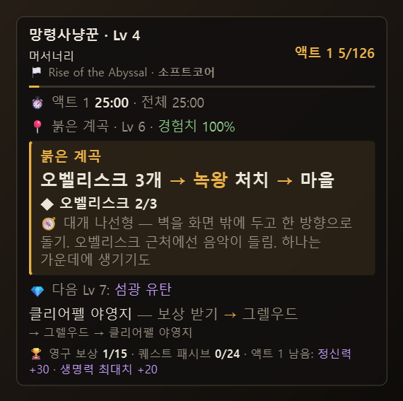
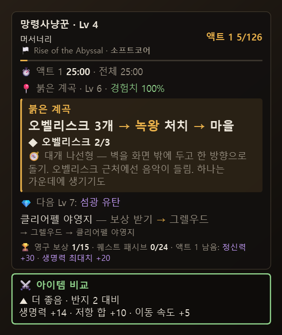
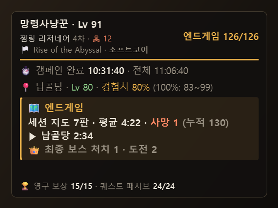

# POE2 새기다 (Saegida)

**캠페인 가이드 오버레이 — 게임 로그만 읽고, 게임 메모리는 절대 읽지 않습니다**

새기다 *(saegida)*: 마음에 새기다, 돌에 새기다. 진행·보상·기록을 놓치지 않게 새겨 두는 도구라는 뜻입니다.

**한국어** · [English](README.en.md)

Path of Exile 2 캠페인을 진행할 때 **지금 해야 할 일**을 게임 화면 구석에 보여주는 오버레이입니다.
게임이 남기는 로그 파일만 읽어서, 접속한 캐릭터와 들어간 지역을 알아서 따라갑니다.
단계를 넘기려고 버튼을 누를 필요가 없습니다.

## 이런 걸 해 줍니다

| | |
|---|---|
| **가이드 자동 진행** | 지역을 옮기면 가이드 단계가 따라 넘어갑니다. 마을에 잠깐 들른 건 무시하고, 보스를 잡기 전에는 다음 단계로 넘기지 않습니다. |
| **보스 전투 표시** | 보스 대사로 전투 시작·페이즈·처치를 알아채고, 전투 중에는 패널을 한 줄로 줄입니다. |
| **영구 보상·퀘스트 패시브 체크** | 저항·정신력·생명력 같은 캠페인 보상과 퀘스트 패시브(+2) 24점 중 몇 개를 받았는지, 이 액트에 남은 게 무엇인지 보여줍니다. |
| **지역 길 찾기 메모 🧭** | 지역마다 "벽 따라 시계 방향" 같은 짧은 길 찾기 팁. |
| **경험치 효율** | 지역 레벨과 내 레벨로 경험치 패널티를 계산해 보여줍니다. |
| **액트 스플릿 타이머** | 액트마다 걸린 시간, 이전 캐릭터 최고 기록(PB)과의 차이. |
| **아이템 비교** | 게임에서 Ctrl+C 한 장비를 끼고 있는 장비와 비교해 더 좋은지 알려줍니다. |
| **젬 안내** | 게임 빌드 플래너에 연결된 빌드를 읽어, 지금 레벨에 쓸 스킬·보조 젬과 다음에 열릴 젬을 보여줍니다. |
| **완주 카드 · LiveSplit** | 캠페인을 끝내면 액트별 기록이 담긴 공유용 카드(PNG)를 저장하고, 스플릿을 LiveSplit 파일로 내보냅니다. |
| **엔드게임 기록** | 캠페인을 끝낸 캐릭터는 이번 세션 지도 수·평균 시간·사망, 최종 보스 도전·처치 기록. |
| **한국어 / English** | 카카오(한국어)·Steam/GGG(영어) 클라이언트 모두. 화면 언어도 고를 수 있습니다. |

<table>
<tr>
<td> 캠페인 진행</td>
<td> 아이템 비교 (Ctrl+C)</td>
<td> 엔드게임 기록</td>
</tr>
</table>

## 시작하기

1. [Releases](../../releases)에서 **`poe2-saegida-setup-*.exe`**(설치 파일)를 받아 실행합니다.
   - 관리자 권한 없이 내 계정에만 설치됩니다. 시작 메뉴 바로가기, 바탕 화면 아이콘·Windows 시작 시 자동 실행(선택)을 만들어 줍니다.
   - 새 버전도 설치 파일을 받아 그대로 실행하면 덮어쓰기로 업데이트됩니다. 설정·진행 기록은 그대로 남습니다.
   - 설치 없이 쓰려면 `poe2-saegida-*-portable.zip`을 원하는 곳에 풀고 `poe2-saegida.exe`를 실행하세요.
   - Windows SmartScreen이 "알 수 없는 게시자" 경고를 띄우면 **추가 정보 → 실행**을 누르세요(서명하지 않은 개인 제작 프로그램이라 나오는 경고입니다).
2. 게임을 **창 모드 전체 화면**(테두리 없는 창)으로 설정합니다. 전체 화면 모드에서는 오버레이가 게임 위에 보이지 않습니다.
3. 오버레이를 실행합니다. 게임 로그 파일은 자동으로 찾습니다.
4. 게임에 접속해 지역을 옮기면 캐릭터와 진행 위치를 알아서 잡습니다.

제거는 Windows **설정 → 앱**에서 합니다. 설정·진행 기록(`%APPDATA%\poe2-saegida`)은 지워지지 않으니, 완전히 지우려면 그 폴더도 지우세요.

처음 실행하면 지금까지의 로그 전체를 읽어서 예전 캐릭터들의 진행·기록도 되살립니다(몇 초).

## 기본 조작

| 키 | 동작 |
|---|---|
| `Ctrl+Alt+→` / `←` | 다음 / 이전 단계 (자동 진행이 어긋났을 때) |
| `Ctrl+Alt+R` | 영구 보상·구간 기록·최종 보스 목록 |
| `Ctrl+Alt+G` | 젬 카드 |
| `Ctrl+Alt+T` | 클릭 통과 (패널을 마우스가 그냥 지나가게) |
| `Ctrl+Alt+H` | 숨기기 / 보이기 |
| 게임에서 장비에 `Ctrl+C` | 아이템 비교 (두 번 누르면 "지금 끼고 있는 장비"로 등록) |

패널에 마우스를 올리면 오른쪽 위에 `◀ ▶ 🏆 💎 ⚙` 아이콘이 나타납니다. 우클릭하면 전체 메뉴가 열립니다.
자세한 설명은 **[사용 설명서](docs/MANUAL.md)** 를 보세요.

## 안전한가요?

| 🚫 절대 하지 않는 것 | ✅ 대신 하는 것 |
|---|---|
| 게임 메모리 읽기 | 게임이 직접 남기는 **로그 파일**(`Client.txt` / `KakaoClient.txt`)만 읽습니다 |
| 게임에 키 입력 보내기 (자동 조작) | 화면에 **보여주기만** 합니다. 모든 키는 직접 누릅니다 |
| 게임 파일·프로세스 수정 | 게임 폴더에는 아무것도 쓰지 않습니다 |
| 게임 데이터를 밖으로 보내기 | 모든 기록은 내 PC(`%APPDATA%\poe2-saegida`)에만 저장됩니다. 인터넷은 **새 버전 확인**(GitHub에 최신 버전만 물어봄, 메뉴에서 끌 수 있음)에만 씁니다 |

클립보드는 **게임 창이 앞에 있을 때** 복사한 아이템 문구만 읽습니다.

Grinding Gear Games, Kakao Games와 관련 없는 개인 제작 도구입니다.

## 라이선스

[MIT](LICENSE)

## 크레딧

- 지역 팁 일부: [POE2Radar](https://github.com/Sikaka/POE2Radar) `zone_notes.json` (MIT, 원문 Path of Levelling 2)을 요약·번역
- 보스·지역·보상 영어 이름: [poe2db.tw](https://poe2db.tw)
- 영어 클라이언트 로그 형식: [bear421/poe-map-log-viewer](https://github.com/bear421/poe-map-log-viewer) (MIT) 문서
- 젬 내부 ID → 이름: [Path of Building (PoE2)](https://github.com/PathOfBuildingCommunity/PathOfBuilding-PoE2) `Data/Gems.lua`
- 막간 지역 팁 일부: [poe2way 액트 가이드](https://www.poe2way.com/act-guide/ko) 요약
