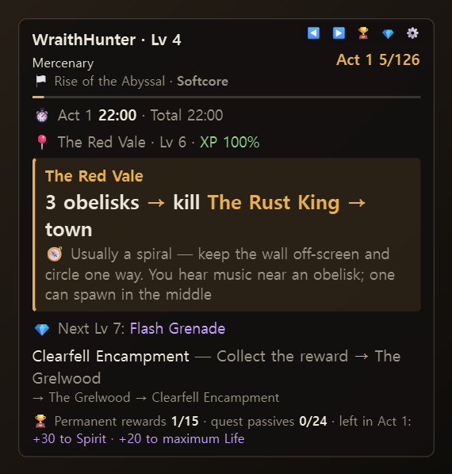
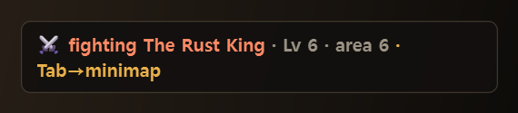
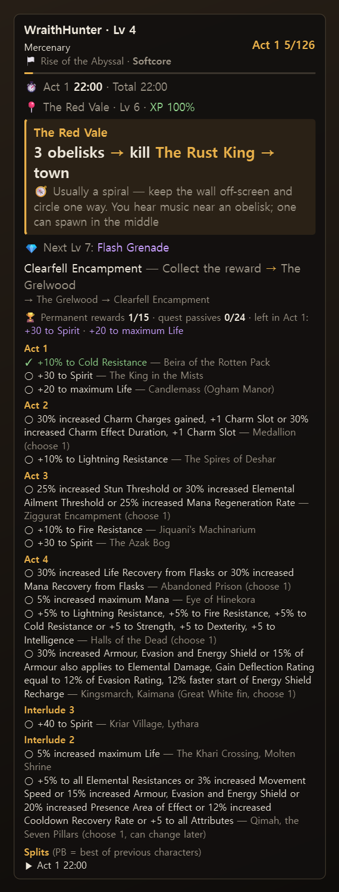
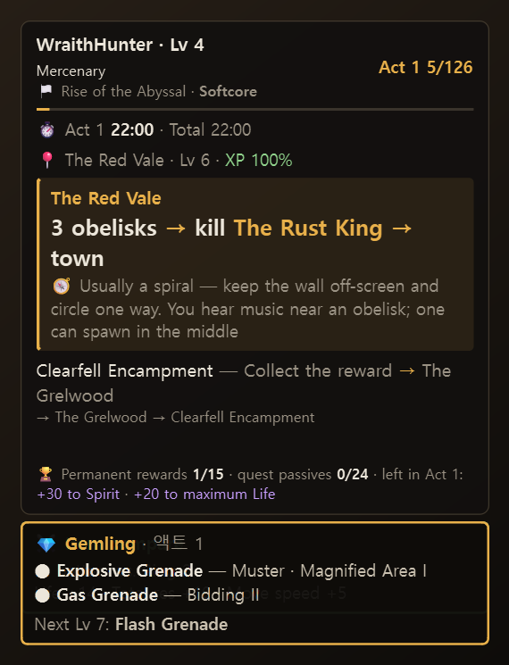

# User manual

[한국어](MANUAL.md) · **English** · [← README](../README.en.md)

1. [Install and run](#1-install-and-run)
2. [Reading the panel](#2-reading-the-panel)
3. [Auto-advancing guide](#3-auto-advancing-guide)
4. [Boss fights](#4-boss-fights)
5. [Permanent rewards and quest passives](#5-permanent-rewards-and-quest-passives)
6. [Split timer](#6-split-timer)
7. [Item compare](#7-item-compare)
8. [Gem guide](#8-gem-guide)
9. [Vendor regex](#9-vendor-regex)
10. [Endgame log](#10-endgame-log)
11. [Exports and updates](#11-exports-and-updates)
12. [Language](#12-language)
13. [Hotkeys and menu](#13-hotkeys-and-menu)
14. [Files](#14-files)
15. [Troubleshooting](#15-troubleshooting)

---

## 1. Install and run

- Windows 10/11. Install with `poe2-saegida-setup-*.exe`, or unzip the portable zip, keep the folder together and run `poe2-saegida.exe`.
- Set the game to **Windowed Fullscreen** (borderless) so the overlay can draw on top.
- The log file is found automatically: Steam/GGG `…\Path of Exile 2\logs\Client.txt`, Kakao `C:\Daum Games\Path of Exile2\logs\KakaoClient.txt`.
  Installed elsewhere? Right-click → **Choose log file…**.
- While the game is closed it shows "Waiting for PoE2" and picks up again when you log in.
- Default position is the top-left of the game window, under the buff icons. Drag the panel to move it; Right-click → **Reset position** to put it back.

## 2. Reading the panel

| Line | Meaning |
|---|---|
| First line | Character name and level. `(guess)` until the name appears in the log |
| Second line | Class and ascension stage (`Asc 4`), total deaths `☠` |
| Third line | League and mode (Softcore / Hardcore / SSF) |
| Right side | Act and guide step (`Act 1 5/126`) |
| ⏱ | Time in this act, PB difference, total play time |
| 📍 | Area, area level and **XP efficiency** (if below 100%, the area level range that gives 100%) |
| Card | The current step: area, what to do, ◆ progress (obelisks 2/3 …), ⚔/✓ boss, 🎁 rewards here, 🧭 layout tip |
| 💎 | Next gem for your level (if a build is linked) |
| Below | The next step and the areas after it |
| 🏆 | Permanent rewards n/15 · quest passives n/24 · rewards left in this act |

Hover the panel for the top-right icons: `◀ ▶` step, `🏆` rewards & splits, `💎` gem card, `⚙` full menu.

## 3. Auto-advancing guide

- **Which character**: the log does not name the character you log in with. Right after login the overlay **guesses** from the areas you enter (`(guess)`) and **confirms** on the first line with your name (level-up, reward, death). To pick manually: Right-click → **Character**.
- **New character**: starting in The Riverbank counts as a new character and shows a mode picker (Softcore / Hardcore / SSF / HC SSF).
- **When a step advances**
  - Entering the area of a later step moves there, even if you skipped steps.
  - A town only counts when **the very next step is that town** — quick restock visits are ignored.
  - A step with a boss **does not advance on a town visit until the boss is dead**.
  - Going somewhere off the guide order shows `off the guide route` on the 📍 line; it continues once you are back on track.
- If it gets it wrong, fix it with `Ctrl+Alt+→ / ←` (or `◀ ▶`).

### Guide files

Pick one under Right-click → **Guide**.
- **Standard (all rewards)**: `guides/default_en.csv` / `default_ko.csv` (matching the screen language)
- **Speedrun**: `guides/speedrun_en.csv` / `speedrun_ko.csv`. Main quests plus the permanent rewards on the way (passive points, spirit, resistances); side content that only gives gems or currency (Molten Vault, the Whakapanu shark, ...) is skipped. Tips from the reference run (GuyThatDies, 3:46 on patch 0.5) are in the steps (respawn at checkpoint to skip dialogue, which monsters drop the relics, ...), and each act end shows its cumulative time. Interludes go 3 → 2 → 1. Detours outside the guide are fine; it catches up when you enter the next area.
- **Choose guide CSV…**: your own file

Format: `id,area_name,quest` (`id` = the area code from the log, lower case). Edits are picked up automatically. Wrap a word in 「 」 to highlight it.

## 4. Boss fights

- When the boss speaks: `⚔ fighting`; phase lines show `Phase 2` etc.; a kill line or **leaving the area alive** gives `✓ killed`; dying gives `☠ died`.
- During a fight the panel shrinks to **one line**, and a `Tab→minimap` hint shows for 3 seconds when it starts (it never presses keys for you). Both can be turned off in the menu.
- Taunts right after you die ("What a sweet scream…") do not restart the fight.
- **English client**: kill and phase lines are only known for the Korean client so far, so on English a fight starts on the boss's first line and ends when you leave the area alive.

## 5. Permanent rewards and quest passives

- The 15 **permanent campaign rewards** (resistances, spirit, life …) are ticked from the log's "You have received …" lines.
- Choice rewards get a short suggestion: `🎁 3 tattoos: +5% resistances or +5 attributes · pick: Attributes`.
- **Quest passives +2** (12 sources such as Books of Specialisation) show as 🎁 on their step and become `✓ quest passives +2 received`. Using a book in town still counts for the area you just came from.
- `Ctrl+Alt+R` (or 🏆): rewards per act (finished acts fold into one line), splits and pinnacle boss records.

## 6. Split timer

- Play time = time between log lines, minus AFK, logouts/restarts and gaps over 30 minutes.
- A split starts the **first time you enter a non-town area** of that act or interlude. The first map ends the campaign.
- PB = the fastest time for that split among **other characters** in the same log. Splits under 10 minutes and campaigns under 3 hours (test characters) are ignored.
- The panel shows only the difference, like `(PB +2:03)`; PB times are in `Ctrl+Alt+R`. PB comparison is off by default (menu).

## 7. Item compare

- Hover a piece of gear in game and press `Ctrl+C` → compared with what you wear in that slot: `▲ better / ▼ worse / ≈ similar` plus the differences.
- **Saving what you wear**: `Ctrl+C` twice quickly on the equipped item (or `Ctrl+Alt+E`). The first item you copy outside town is saved automatically.
- **Rings** have two slots: a saved ring goes to the weaker slot; double-copy again to move it to the other one. Comparisons are shown against both rings.
- Weapons are judged by DPS (physical / elemental / attack speed / crit); armour and jewellery by life, resistances (1% = 3 life), movement speed, added damage, defences, spirit and skill levels.
- `Ctrl+C` on an uncut gem → what to make from it for your build.

## 8. Gem guide

- Reads the in-game **Build Planner** (`Documents\My Games\Path of Exile 2\BuildPlanner\*.build`). Link a build to your character in game and it follows automatically, or pick one with Right-click → **Build (gem guide)**.
- If the build is split into act files (`Name 1. Act 1-2`, `Name 2. Act 3` …), the file for your current act is used.
- The panel shows the next gem; `Ctrl+Alt+G` (💎) shows every skill with its supports.
- When a new gem becomes usable: `💎 Lv 7 — Flash Grenade can be equipped`.

## 9. Vendor regex

- Talking to a vendor in town copies a shop search regex for your build and act to the clipboard. Paste with `Ctrl+V`.
- Copy manually with `Ctrl+Alt+C`; auto-copy can be turned off in the menu.
- The regex has to match the game's item text, so it is **Korean client only** for now.

## 10. Endgame log

For characters that finished the campaign, the last guide step is replaced by:

- Maps this session, average time and deaths (a gap of over 2 hours between maps starts a new session), and total maps
- `▶ map name and elapsed time` while you are in a map
- Pinnacle kills and attempts in total; per-boss records in `Ctrl+Alt+R`
  - Kills are only counted where the log confirms them (Korean client: Arbiter of Ash, the Ritual pinnacle). Others count attempts and deaths.

## 11. Exports and updates

**Campaign complete card**: the moment you finish the campaign (enter your first map), a card (PNG) with act times, PB differences and deaths is saved to `Pictures\POE2 Saegida`. For characters that finished earlier: Right-click → **Export records → Campaign complete card**.

**LiveSplit**: Right-click → Export records → **LiveSplit splits file (.lss)**. This character's splits become the PB and the best split across all characters becomes the gold. Open it in LiveSplit as a target for your next run.

**Updates**: at start and every 6 hours it asks GitHub for the latest version (no game data is sent). When there is one, a `🆕 Version … is out` line appears under the panel.
- Installed with the installer: Right-click → **🆕 Install update** downloads it, checks size and SHA-256, installs over the old version and restarts (settings and records are kept).
- Portable zip: opens the release page.
- Right-click → **Updates** to check now or turn automatic checks off.

## 12. Language

- Right-click → **Language / 언어**: Auto / 한국어 / English. The overlay restarts when you change it.
- **Auto** detects the game language from the last area name in the log (the Kakao client can run in English too). If you switch the game language, the overlay notices on the next area change and restarts.
- Data matched against the log (reward lines, boss lines, regex) follows the **game language**; menus, guide and tips follow the **screen language**. Reward history carries over if you switch the game language mid-character.

## 13. Hotkeys and menu

| Hotkey | Action |
|---|---|
| `Ctrl+Alt+→` / `Ctrl+Alt+←` | Next / previous step |
| `Ctrl+Alt+R` | Rewards, splits and pinnacle bosses |
| `Ctrl+Alt+G` | Gem card |
| `Ctrl+Alt+C` | Copy vendor regex |
| `Ctrl+Alt+E` | Save the last copied item as equipped |
| `Ctrl+Alt+T` | Click-through on/off |
| `Ctrl+Alt+H` | Hide / show |
| `Ctrl+Alt+A` | Auto-hide when the game is not focused |
| `Ctrl+Alt+↑` / `Ctrl+Alt+↓` | Opacity |

The right-click menu (or ⚙) also has character, mode and build selection, compact boss mode, Tab hint, zone tips, regex auto-copy, PB comparison, reset position, guide and log file selection, language and quit.

## 14. Files

| File | Contents |
|---|---|
| `%APPDATA%\poe2-saegida\settings.json` | Settings (position, opacity, language, build per character …) |
| `%APPDATA%\poe2-saegida\progress.json` | Per-character progress, rewards, splits, gear, endgame log, and how far the log was read |
| `%APPDATA%\poe2-saegida\overlay.log` | Start/stop and errors |
| `guides\*.json`, `guides\*.csv` | Guide, boss, reward and zone tip data (`_ko` / `_en`) |

Deleting `progress.json` makes the next start re-read the whole log (values that are not in the log, like saved gear, are lost).

## 15. Troubleshooting

| Problem | Fix |
|---|---|
| "Windows protected your PC" when installing | Shown because the tool has no code-signing certificate. **More info → Run anyway**. To check the file, compare the release page's `sha256:` with PowerShell `Get-FileHash` |
| Overlay not visible over the game | Use Windowed Fullscreen. Check it isn't hidden (`Ctrl+Alt+H`) or auto-hidden (`Ctrl+Alt+A`) |
| Wrong guide step | Correct it with `Ctrl+Alt+→ / ←`; it keeps following from there |
| Wrong character / stays `(guess)` | Confirmed on your next level-up etc. Or pick it: Right-click → Character |
| Panel went off-screen | Right-click → Reset position |
| Hotkeys don't work | Another program uses the same keys; "Hotkey registration failed" shows under the panel |
| Can't click the panel | Click-through is on (`🔒`). `Ctrl+Alt+T` |
| A reward never ticks / boss never shows | Please open an issue with the log lines — especially on the English client |
