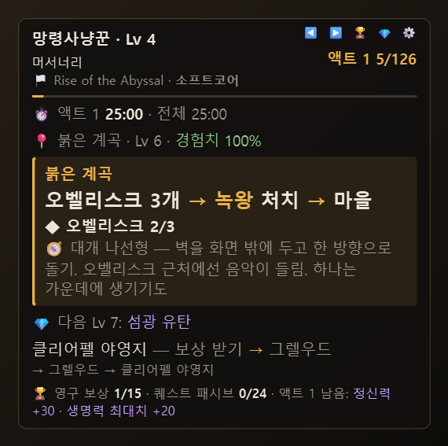
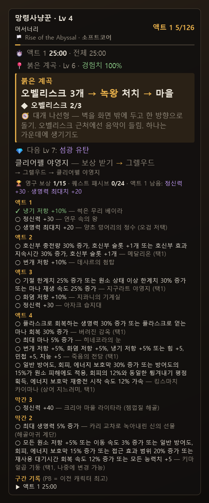
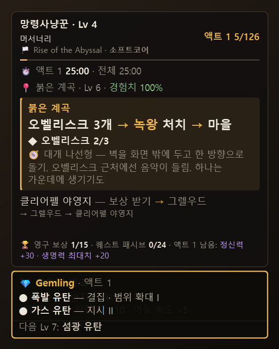

# 사용 설명서

**한국어** · [English](MANUAL.en.md) · [← README](../README.md)

1. [설치와 실행](#1-설치와-실행)
2. [패널 읽는 법](#2-패널-읽는-법)
3. [가이드 자동 진행](#3-가이드-자동-진행)
4. [보스 전투](#4-보스-전투)
5. [영구 보상·퀘스트 패시브](#5-영구-보상퀘스트-패시브)
6. [스플릿 타이머](#6-스플릿-타이머)
7. [아이템 비교](#7-아이템-비교)
8. [젬 안내](#8-젬-안내)
9. [상인 정규식](#9-상인-정규식)
10. [엔드게임 기록](#10-엔드게임-기록)
11. [기록 내보내기·업데이트](#11-기록-내보내기업데이트)
12. [언어](#12-언어)
13. [단축키·메뉴](#13-단축키메뉴)
14. [파일 위치](#14-파일-위치)
15. [문제 해결](#15-문제-해결)

---

## 1. 설치와 실행

- Windows 10/11. 설치 파일(`poe2-saegida-setup-*.exe`)로 설치하거나, 휴대용 zip을 풀어 폴더째로 두고 `poe2-saegida.exe`를 실행합니다.
- 게임은 **창 모드 전체 화면**(테두리 없는 창)이어야 오버레이가 게임 위에 보입니다.
- 로그 파일은 자동으로 찾습니다. 카카오판 `C:\Daum Games\Path of Exile2\logs\KakaoClient.txt`, Steam/GGG판 `…\Path of Exile 2\logs\Client.txt`.
  다른 곳에 설치했다면 우클릭 → **로그 파일 선택…**.
- 게임이 꺼져 있으면 "PoE2 실행 대기 중"으로 기다리다가, 접속하면 이어서 추적합니다.
- 기본 위치는 게임 창 왼쪽 위(버프 아이콘 아래)입니다. 패널을 끌어서 옮길 수 있고, 우클릭 → **위치 초기화**로 되돌립니다.

## 2. 패널 읽는 법

| 줄 | 내용 |
|---|---|
| 첫 줄 | 캐릭터 이름·레벨. 아직 이름이 로그에 안 찍혔으면 `(추정)` |
| 둘째 줄 | 직업·전직 단계(`4차`), 누적 사망 `☠` |
| 셋째 줄 | 리그·모드(소프트코어/하드코어/SSF) |
| 오른쪽 | 액트와 가이드 단계 번호 (`액트 1 5/126`) |
| ⏱ | 지금 액트 시간, PB 차이, 전체 플레이 시간 |
| 📍 | 지금 지역·지역 레벨·**경험치 효율**(100%가 아니면 100%를 받는 지역 레벨 범위) |
| 카드 | 지금 단계: 지역 이름, 할 일, ◆ 진행 표시(오벨리스크 2/3 등), ⚔/✓ 보스, 🎁 받을 보상, 🧭 길 찾기 메모 |
| 💎 | 다음 레벨에 쓸 젬 (빌드가 연결된 경우) |
| 그 아래 | 다음 단계와 그 뒤 지역들 |
| 🏆 | 영구 보상 n/15 · 퀘스트 패시브 n/24 · 이 액트에 남은 보상 |

마우스를 올리면 오른쪽 위에 아이콘이 나타납니다. `◀ ▶` 단계 이동, `🏆` 보상·기록 목록, `💎` 젬 카드, `⚙` 전체 메뉴.

## 3. 가이드 자동 진행

- **캐릭터 인식**: 로그에는 접속한 캐릭터 이름이 바로 남지 않습니다. 접속 직후에는 들어간 지역으로 캐릭터를 **추정**하고(`(추정)`), 레벨업·보상·사망처럼 이름이 찍히는 줄이 나오면 **확정**합니다. 직접 고르려면 우클릭 → **캐릭터**.
- **새 캐릭터**: 강둑에서 시작하면 새 캐릭터로 보고 모드(소프트코어/하드코어/SSF/HC SSF)를 고르는 줄이 나타납니다.
- **단계 넘기기 규칙**
  - 다음 단계의 지역에 들어가면 넘어갑니다. 몇 단계를 건너뛰어도 따라갑니다.
  - 마을은 **바로 다음 단계가 마을일 때만** 넘어갑니다. 정비하러 잠깐 들른 건 무시합니다.
  - 보스가 있는 단계는 **보스를 잡기 전에는** 마을에 가도 넘어가지 않습니다.
  - 가이드 순서와 다른 곳에 가면 📍 줄에 `가이드 경로 밖`이 뜹니다. 원래 길로 돌아오면 이어서 진행합니다.
- 어긋났을 때는 `Ctrl+Alt+→ / ←`(또는 `◀ ▶`)로 맞추면 됩니다.

### 가이드 파일

우클릭 → **가이드**에서 고릅니다.
- **기본 (보상 다 챙기기)**: `guides/default_ko.csv` / `default_en.csv` (화면 언어에 맞춰)
- **스피드런**: `guides/speedrun_ko.csv` / `speedrun_en.csv`. 패시브 포인트·정신력·저항 같은 영구 보상만 챙기고 젬·화폐만 주는 곁가지는 건너뜁니다. 선택 단계는 `(선택)`으로 표시되고, 건너뛰어도 다음 지역에 들어가면 따라옵니다. 막간은 3 → 2 → 1 순서, 액트가 끝날 때 참고 영상(GuyThatDies, 0.5 기준 3:46)의 누적 시간이 함께 나옵니다.
- **CSV 선택…**: 직접 만든 파일

형식은 `id,area_name,quest` 입니다(`id` = 로그의 지역 코드, 소문자). 파일을 고치면 자동으로 다시 읽습니다. 「단어」로 감싸면 강조됩니다.

## 4. 보스 전투

- 보스가 말하면 `⚔ 전투 중`, 페이즈 대사가 나오면 `2페이즈` 같은 표시, 처치 대사가 나오거나 **살아서 지역을 떠나면** `✓ 처치`, 죽으면 `☠ 사망`.
- 전투 중에는 패널이 **한 줄**로 줄어들고, 전투가 시작될 때 3초간 `Tab→미니맵` 안내가 나옵니다(키를 대신 누르지는 않습니다). 둘 다 메뉴에서 끌 수 있습니다.
- 사망 직후 보스가 하는 말("참으로 달콤한 비명을 내는구나" 등)은 전투 재개로 보지 않습니다.
- 대사가 없는 보스는 이름 대신 "곧 보스" 신호(옆 NPC의 외침 등)로 잡거나, 지역을 떠날 때 처치로 봅니다.

## 5. 영구 보상·퀘스트 패시브

- 로그의 `…을(를) 획득했습니다` 줄로 저항·정신력·생명력 같은 **캠페인 영구 보상 15개**를 자동 체크합니다.
- 고르는 보상(택1)에는 짧은 추천이 붙습니다: `🎁 문신 3개: 저항 +5% 또는 능력치 +5 · 추천: 능력치`.
- **퀘스트 패시브 +2**(특화의 서 등 12곳)는 받을 단계에 🎁로, 받으면 `✓ 퀘스트 패시브 +2 받음`으로 바뀝니다. 마을에서 책을 써도 직전 사냥터의 보상으로 기록합니다.
- `Ctrl+Alt+R`(또는 🏆): 액트별 보상 목록(다 받은 액트는 한 줄로 접힘), 구간 기록, 최종 보스 기록.

## 6. 스플릿 타이머

- 플레이 시간 = 로그 줄 사이 시간의 합. 자리 비움, 로그아웃·재시작, 30분 넘는 공백은 뺍니다.
- 액트(막간 포함)의 **사냥터에 처음 들어간 순간**이 구간 경계입니다. 지도에 처음 들어가면 캠페인 완료.
- PB = 같은 PC 로그의 **다른 캐릭터** 중 그 구간 최단 기록. 10분 미만 구간·3시간 미만 캠페인(테스트 캐릭터)은 PB에서 뺍니다.
- 패널에는 `(PB +2:03)`처럼 차이만, PB 기록은 `Ctrl+Alt+R` 구간 기록에 나옵니다. PB 비교는 메뉴에서 켭니다(기본 꺼짐).

## 7. 아이템 비교

- 게임에서 장비에 마우스를 올리고 `Ctrl+C` → 지금 끼고 있는 같은 부위 장비와 비교해 `▲ 더 좋음 / ▼ 더 나쁨 / ≈ 비슷`과 차이를 보여줍니다.
- **끼고 있는 장비 등록**: 끼고 있는 장비에 `Ctrl+C`를 빠르게 두 번(또는 `Ctrl+Alt+E`). 사냥터에서 처음 복사한 장비는 자동으로 등록됩니다.
- **반지**는 두 칸: 등록하면 약한 쪽 칸에 들어가고, 다른 칸이었다면 한 번 더 두 번 복사하면 옮겨집니다. 비교는 두 반지 모두와 보여줍니다.
- 무기는 DPS(물리/원소/공속/치명), 방어구·장신구는 생명력·저항(1% = 생명력 3)·이속·추가 피해·방어 수치·정신력·스킬 레벨로 판정합니다.
- 미가공 젬에 `Ctrl+C` → 빌드 기준으로 무엇을 만들면 좋은지 알려줍니다.

## 8. 젬 안내

- 게임의 **빌드 플래너**(`Documents\My Games\Path of Exile 2\BuildPlanner\*.build`)를 읽습니다. 게임에서 캐릭터에 빌드를 연결해 두면 자동으로 따라갑니다. 우클릭 → **빌드 (젬 안내)**에서 직접 고를 수도 있습니다.
- 빌드 파일이 액트별로 나뉘어 있으면(`이름 1. 액트 1-2`, `이름 2. 액트 3` …) 지금 액트에 맞는 파일을 고릅니다.
- 패널에는 다음에 열릴 젬 한 줄, `Ctrl+Alt+G`(💎)에는 지금 쓸 스킬과 보조 젬 전체.
- 새 젬을 쓸 수 있는 레벨이 되면 `💎 Lv 7 — 섬광 유탄 장착 가능` 알림.

## 9. 상인 정규식

- 마을에서 상인과 대화하면 지금 빌드·액트에 맞는 상점 검색 정규식을 클립보드에 복사합니다. 상점 검색창에 `Ctrl+V`.
- 직접 복사: `Ctrl+Alt+C`. 메뉴에서 자동 복사를 끌 수 있습니다.
- 정규식은 게임 언어의 아이템 문구라야 해서, 지금은 **한국어 클라이언트**에서만 동작합니다.

## 10. 엔드게임 기록

캠페인을 끝낸 캐릭터는 마지막 가이드 단계 대신 다음을 보여줍니다.

- 이번 세션 지도 판 수·평균 시간·사망(판 시작 사이가 2시간 넘게 비면 새 세션), 누적 지도 수
- 지도 안에 있으면 `▶ 지도 이름 경과 시간`
- 최종 보스 처치·도전 합계. 보스별 기록은 `Ctrl+Alt+R`
  - 처치까지 세는 보스: 재의 중재자, 의식 최종 보스(보닥) — 처치 뒤 NPC가 항상 같은 말을 해서 알 수 있습니다.
  - 나머지(연무 속의 왕, 신성의 중재자, 성채 보스, 쿨레막, 섬망)는 도전·사망만 셉니다.

## 11. 기록 내보내기·업데이트

**캠페인 완주 카드**: 캠페인을 끝내는(첫 지도에 들어가는) 순간 액트별 시간·PB 차이·사망이 담긴 카드(PNG)를 `사진\POE2 Saegida`에 저장합니다. 예전에 끝낸 캐릭터는 우클릭 → **기록 내보내기 → 캠페인 완주 카드**.

**LiveSplit**: 우클릭 → 기록 내보내기 → **LiveSplit 스플릿 파일(.lss)**. 이 캐릭터의 구간 기록이 PB, 모든 캐릭터 중 구간별 최고가 골드로 들어갑니다. LiveSplit에서 열어 다음 캐릭터의 목표로 쓰면 됩니다.

**새 버전**: 시작할 때와 6시간마다 GitHub에 최신 버전만 물어봅니다(게임 데이터는 보내지 않음). 새 버전이 있으면 패널 아래에 `🆕 새 버전` 줄이 뜹니다.
- 설치 파일로 설치했다면 우클릭 → **🆕 업데이트 설치** → 내려받아 크기·SHA-256을 확인한 뒤 덮어쓰기 설치하고 다시 실행합니다(설정·기록 유지).
- 휴대용 zip이면 릴리스 페이지가 열립니다.
- 우클릭 → **업데이트** 메뉴에서 지금 확인하거나 자동 확인을 끌 수 있습니다.

## 12. 언어

- 우클릭 → **언어 / Language**: 자동 / 한국어 / English. 바꾸면 오버레이가 다시 시작합니다.
- **자동**은 로그의 마지막 지역 이름이 한글인지로 게임 언어를 판단합니다(카카오판도 영어로 바꿀 수 있어서). 게임 언어를 바꾸면 다음 지역 이동 때 알아채고 다시 시작합니다.
- 로그와 맞춰 보는 데이터(보상 문구, 보스 대사, 정규식)는 **게임 언어**, 화면 문구·가이드·지역 팁은 **화면 언어**를 따릅니다. 게임 언어를 중간에 바꾼 캐릭터도 보상 기록이 이어집니다.

## 13. 단축키·메뉴

| 단축키 | 동작 |
|---|---|
| `Ctrl+Alt+→` / `Ctrl+Alt+←` | 다음 / 이전 단계 |
| `Ctrl+Alt+R` | 영구 보상·구간 기록·최종 보스 목록 |
| `Ctrl+Alt+G` | 젬 카드 |
| `Ctrl+Alt+C` | 상인 정규식 복사 |
| `Ctrl+Alt+E` | 마지막으로 복사한 장비를 "끼고 있는 장비"로 등록 |
| `Ctrl+Alt+T` | 클릭 통과 켜기/끄기 |
| `Ctrl+Alt+H` | 숨기기 / 보이기 |
| `Ctrl+Alt+A` | 게임 창이 아닐 때 자동 숨김 켜기/끄기 |
| `Ctrl+Alt+↑` / `Ctrl+Alt+↓` | 투명도 |

우클릭 메뉴(또는 ⚙)에는 위 기능과 함께 캐릭터·모드·빌드 선택, 보스전 간단 모드, Tab 안내, 지역 메모, 정규식 자동 복사, PB 비교, 위치 초기화, 가이드·로그 파일 선택, 언어, 종료가 있습니다.

## 14. 파일 위치

| 파일 | 내용 |
|---|---|
| `%APPDATA%\poe2-saegida\settings.json` | 설정(위치, 투명도, 언어, 캐릭터별 빌드 등) |
| `%APPDATA%\poe2-saegida\progress.json` | 캐릭터별 진행·보상·스플릿·장비·엔드게임 기록, 로그를 어디까지 읽었는지 |
| `%APPDATA%\poe2-saegida\overlay.log` | 시작·종료와 오류 기록 |
| `guides\*.json`, `guides\*.csv` | 가이드·보스·보상·지역 팁 데이터 (`_ko` / `_en`) |

`progress.json`을 지우면 다음 실행 때 로그 전체를 다시 읽어 처음부터 계산합니다(장비 등록처럼 로그에 없는 값은 사라집니다).

## 15. 문제 해결

| 증상 | 해결 |
|---|---|
| 오버레이가 게임 위에 안 보임 | 게임을 창 모드 전체 화면으로. `Ctrl+Alt+H`로 숨겨져 있는지, 자동 숨김(`Ctrl+Alt+A`) 확인 |
| 단계가 어긋남 | `Ctrl+Alt+→ / ←`로 맞추면 그다음부터 이어서 따라갑니다 |
| 다른 캐릭터로 잡힘 / `(추정)`이 계속 | 레벨업 등 이름이 찍히면 확정됩니다. 급하면 우클릭 → 캐릭터에서 선택 |
| 패널이 화면 밖으로 나감 | 우클릭 → 위치 초기화 |
| 단축키가 안 먹음 | 다른 프로그램이 같은 키를 쓰는 경우. 패널 아래에 "단축키 등록 실패"가 뜹니다 |
| 패널을 클릭할 수 없음 | 클릭 통과 중(`🔒` 표시). `Ctrl+Alt+T` |
| 보상이 체크되지 않음 / 보스 표시가 없음 | 로그 줄을 첨부해 이슈로 알려 주세요. 특히 영어 클라이언트 |
